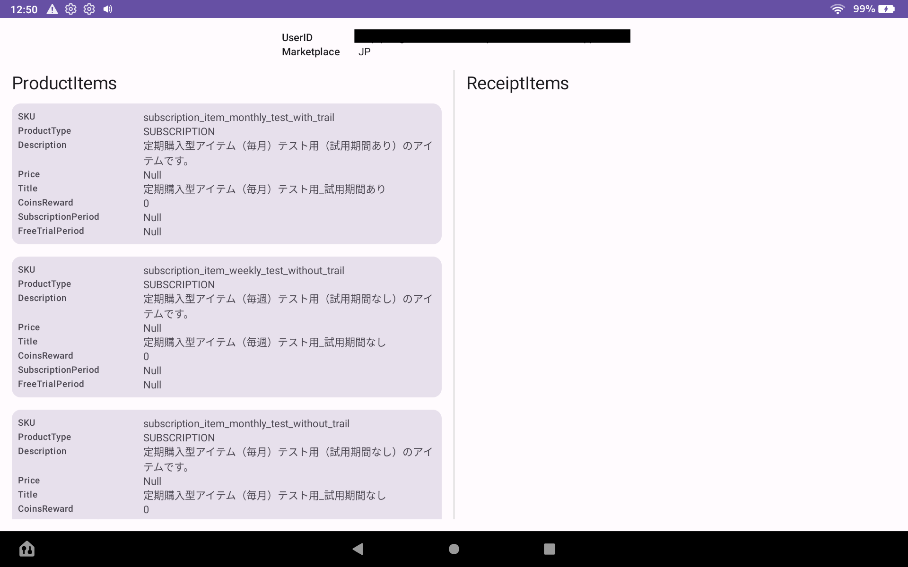
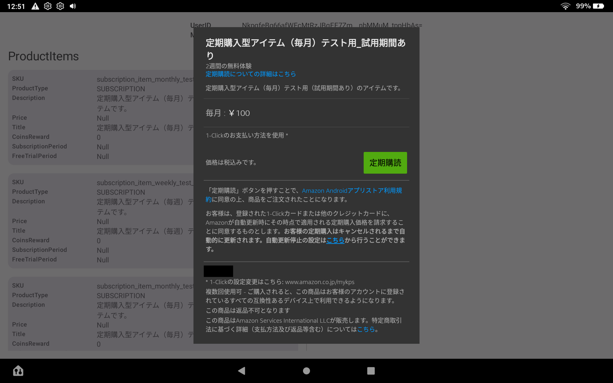
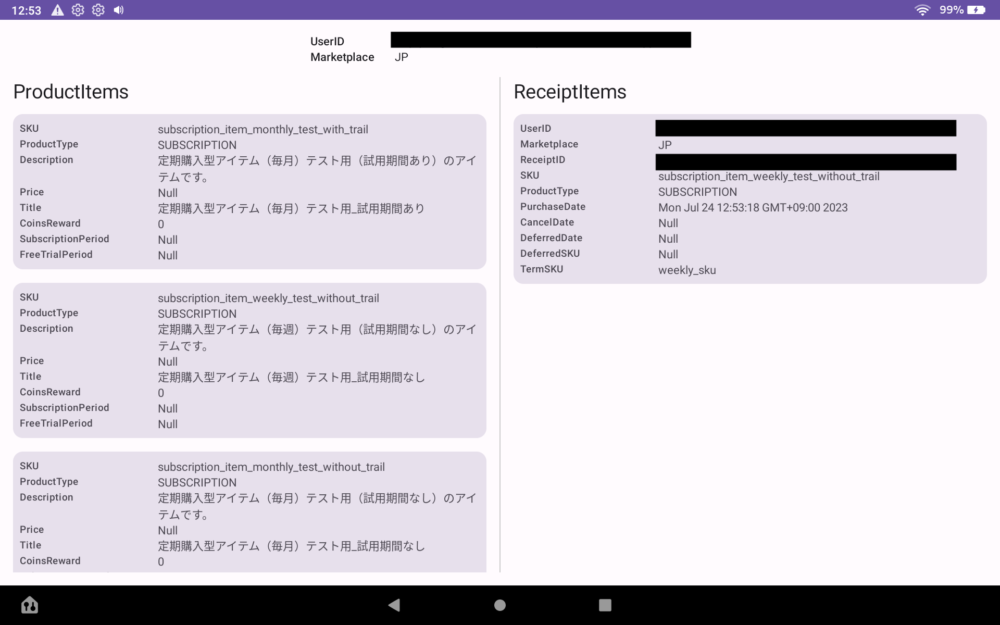

# amazon-purchasing

[](https://opensource.org/licenses/MIT)

## What's this?

This library is Amazon Appstore
SDK's [in-app-purchase](https://developer.amazon.com/ja/docs/in-app-purchasing/iap-implement-iap.html)
wrapper with Coroutine.

## Add dependencies

## How to Use

### Setup
1. Download public key(AppstoreAuthenticationKey.pem) from Amazon Developer Console.(ref:[Configure Appstore SDK with your public key](https://developer.amazon.com/docs/appstore-sdk/integrate-appstore-sdk.html#configure-key))
2. Copy the AppstoreAuthenticationKey.pem file. Then paste it into the app/src/main/assets folder of your Android Studio project.
3. Add ResponseReceiver to the your Manifest with reference to the
documentation [here](https://developer.amazon.com/ja/docs/in-app-purchasing/iap-implement-iap.html#responsereceiver).

### getUserData

```kotlin
coroutineScope.launch {
    val userData = amazonPurchasingService.getUserData()
}
```

### getProductData

```kotlin
coroutineScope.launch {
    val productData = amazonPurchasingService.getProductData(productSkus)
}
```

### purchase

```kotlin
coroutineScope.launch {
    val purchasedReceipt = amazonPurchasingService.purchase(productSku)
}
```

### getPurchaseUpdates

```kotlin
coroutineScope.launch {
    val purchaseUpdates = amazonPurchasingService.getPurchaseUpdates(requestAll)
}
```

### notifyFulfillment

```kotlin
amazonPurchasingService.notifyFulfillment(
    receiptId = receiptId,
    fulfillmentResult = FulfillmentResult.FULFILLED,
)
```

## Sample App

### Setup
1. Download public key from Amazon Developer Console.(ref:[Configure Appstore SDK with your public key](https://developer.amazon.com/docs/appstore-sdk/integrate-appstore-sdk.html#configure-key))
2. Add debug keystore properties in local.properties.

```local.properties
storePassword=android
keyPassword=android
keyAlias=androiddebugkey
storeFile=/Users/{UserName}/.android/debug.keystore
```

3. Execute gradle sync.
4. Add your product skus to ProductSku.kt.

```kotlin
val list = HashSet<String>(
    listOf(
      // add child sku here
    )
  )
```

5. If you are using AppTester, copy the JSON file to the /sdcard/ folder in your device file system.(ref:[Create a JSON Data File](https://developer.amazon.com/docs/in-app-purchasing/iap-install-and-configure-app-tester.html#create-a-json-data-file)) 

### ScreenShot

| Show Products | Purchase | Show Receipts |
|:---:|:---:|:---:|
|  |  |  |
