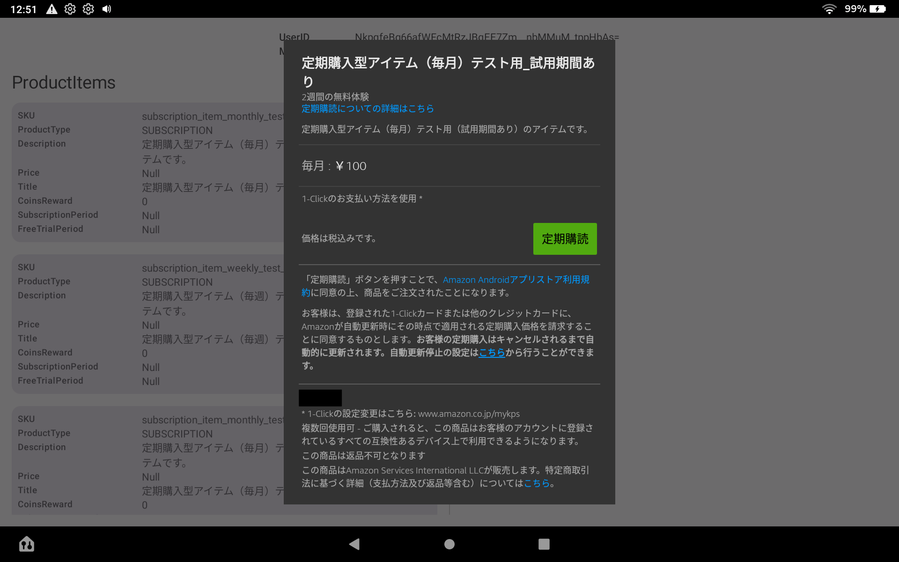

## Sample App

### Setup

1. Download public key from Amazon Developer Console.(
   ref:[Configure Appstore SDK with your public key](https://developer.amazon.com/docs/appstore-sdk/integrate-appstore-sdk.html#configure-key))
2. Add debug keystore properties in local.properties.

```local.properties
storePassword=android
keyPassword=android
keyAlias=androiddebugkey
storeFile=/Users/{UserName}/.android/debug.keystore
```

3. Execute gradle sync.
4. Add your product skus to ProductSku.kt.

```kotlin
val list = HashSet<String>(
  listOf(
    // add child sku here
  )
)
```

5. If you are using AppTester, copy the JSON file to the /sdcard/ folder in your device file
   system.(
   ref:[Create a JSON Data File](https://developer.amazon.com/docs/in-app-purchasing/iap-install-and-configure-app-tester.html#create-a-json-data-file))

### ScreenShot

|                  Show Products                  |                    Purchase                     |                  Show Receipts                  |
|:-----------------------------------------------:|:-----------------------------------------------:|:-----------------------------------------------:|
|  |  |  |
